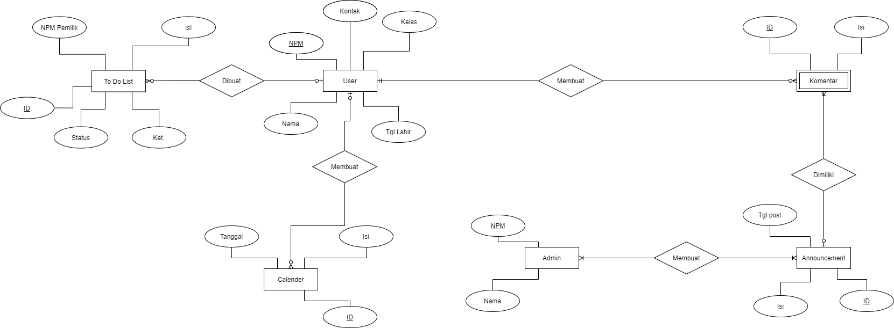

<!-- Logo Proyek -->
 

  

  <h3 align="center">Website Manajemen Angkatan</h3>

  

    Website manajemen untuk angkatan Gopher...
  

<!-- Daftar Isi -->

  
<h2 style="display: inline-block">Daftar Isi</h2>

  <ol>
    <li><a href="#anggota-tim">Anggota Tim</a></li>
    <li><a href="#fungsi">Fungsi</a></li>
    <li><a href="#tujuan">Tujuan</a></li>
    <li><a href="#target-pengguna">Target Pengguna</a></li>
    <li><a href="#mockup-kasar">Mockup Kasar</a></li>
    <li><a href="#skema-database">Skema Database</a></li>
  </ol>

<!-- Anggota Tim -->
## Anggota Tim
| NPM           | Name                      |
| ------------- |---------------------------|
| 140810200035  | Naufal Fahrezi            |
| 140810200053  | Calvin Calfi Montolalu    |
| 140810200059  | Deani Puteri Virdiana     |

<!-- Fungsi -->
## Fungsi

  Fungsi yang ingin dibawakan dalam project ini adalah:
  <ul>
    <li>Lorem ipsum...</li>
    <li>Lorem ipsum...</li>
    <li>Lorem ipsum...</li>
  </ul>

<!-- Tujuan -->
## Tujuan

  Tujuan dari proyek ini adalah sebagai berikut:
  <ul>
    <li>Lorem ipsum...</li>
    <li>Lorem ipsum...</li>
    <li>Lorem ipsum...</li>
  </ul>

<!-- Target Pengguna -->
## Target Pengguna

  Target pengguna yang ingin dicapai adalah ...

<!-- Mockup Kasar -->
## Mockup Kasar
Untuk link figma dapat diakses pada [link](https://www.figma.com/file/B4zdjCBEwfNoNqokeUEe6O/Web-Gopher?node-id=1%3A2).

<!-- Skema Database -->
## Skema Database
<h1>Entity Relation Diagram</h1>

<h1>Tabel Relasi</h1>

<a href="https://drive.google.com/file/d/172h4Bqo5n72F8J5EDgZ69UvWLgr2YD6t/view?usp=sharing">Link Drawio</a>